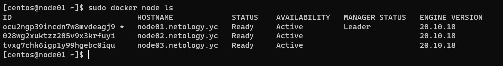
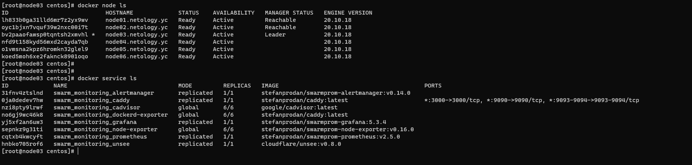
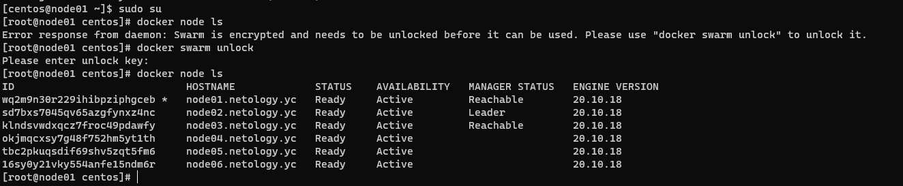

## Задача 1

Дайте письменые ответы на следующие вопросы:

- В чём отличие режимов работы сервисов в Docker Swarm кластере: replication и global?

```
При установке сервиа в режиме replication указывается необходимое количество экземпляров сервиса, далее swarm распределяет данное количество по нодам
В режиме global на каждой ноде будет один сервис, при добавлении ноды сервис добавится автоматически (например контейнер для мониторинга)  
```
- Какой алгоритм выбора лидера используется в Docker Swarm кластере?

```
Используется Raft Consensus Algorithm.
При использовании данного алгоритма участник может быть в одном из 3-х состояний:
Лидер - может быть только один, принимает запросы и реплицирует их на всех учатников
Follower - пассивный сервер, принимает записи от лидера и перенаправляет запросы клиента на лидера
Кандидат - состояние хоста во время выдора лидера.

Алгоритм гарантирует, что лидер всегда будет только один, также никакая информация в распределенном логе не может быть изменена или удалена. 

```

- Что такое Overlay Network?

```
Это распределенная сеть между несколькомо хостами docker, своего рода единый виртуальный свитч, к которому можно подключить контейнеры на любой ноде.
Контейнеры на разных нодах могут напрямую обмениваться через данную сеть (на уровне L2).

```

## Задача 2

Создать ваш первый Docker Swarm кластер в Яндекс.Облаке

Для получения зачета, вам необходимо предоставить скриншот из терминала (консоли), с выводом команды:
```
docker node ls

```
### Ответ
```
Создал терраформом 3 хоста в yandex cloud, далее вручную создал swarm кластер



```

## Задача 3

Создать ваш первый, готовый к боевой эксплуатации кластер мониторинга, состоящий из стека микросервисов.

Для получения зачета, вам необходимо предоставить скриншот из терминала (консоли), с выводом команды:
```
docker service ls
```

### Ответ
```Использовались предоставленные конфигурационные файлы для создания кластера мониторинга.```




## Задача 4 (*)

Выполнить на лидере Docker Swarm кластера команду (указанную ниже) и дать письменное описание её функционала, что она делает и зачем она нужна:
```
# см.документацию: https://docs.docker.com/engine/swarm/swarm_manager_locking/
docker swarm update --autolock=true
```

### Ответ

```
По -умолчанию docker шифрует Raft логи и коммуникационный трафик.
При запуске docker данные ключи загружаются в память без дополнительных действий.
При выполнении команды docker предоставляет приватный ключ для использования ключей шифрования Raft логов и коммуникационного трафика.
После выполнения команды при перезапуске docker необходимо будет сначала разблокировать swarm путем ввода предоставленного ключа.
 
 
 
```