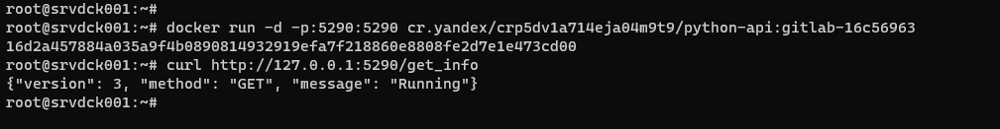
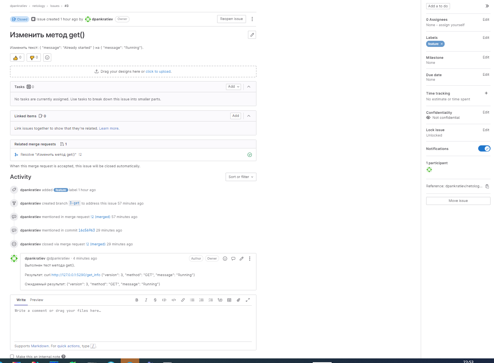

# Домашнее задание к занятию 12 «GitLab»

## Подготовка к выполнению

1. Подготовьте к работе GitLab [по инструкции](https://cloud.yandex.ru/docs/tutorials/infrastructure-management/gitlab-containers).
2. Создайте свой новый проект.
3. Создайте новый репозиторий в GitLab, наполните его [файлами](./repository).
4. Проект должен быть публичным, остальные настройки по желанию.

## Основная часть

### DevOps

В репозитории содержится код проекта на Python. Проект — RESTful API сервис. Ваша задача — автоматизировать сборку образа с выполнением python-скрипта:

1. Образ собирается на основе [centos:7](https://hub.docker.com/_/centos?tab=tags&page=1&ordering=last_updated).
2. Python версии не ниже 3.7.
3. Установлены зависимости: `flask` `flask-jsonpify` `flask-restful`.
4. Создана директория `/python_api`.
5. Скрипт из репозитория размещён в /python_api.
6. Точка вызова: запуск скрипта.
7. Если сборка происходит на ветке `master`: должен подняться pod kubernetes на основе образа `python-api`, иначе этот шаг нужно пропустить.

```text
В gitlab создан проект и подготовлены файлы.
```


<details>
  <summary>.gitlab-ci.yml</summary>

  ```
 stages:
  - build
  - deploy

build:
  stage: build
  variables:
    DOCKER_DRIVER: overlay2
    DOCKER_TLS_CERTDIR: ""
    DOCKER_HOST: tcp://localhost:2375/
  image: cr.yandex/yc/metadata-token-docker-helper:0.2
  services:
    - docker:19.03.1-dind
  script:
    - docker build . -t cr.yandex/crp5dv1a714eja04m9t9/python-api:gitlab-$CI_COMMIT_SHORT_SHA
    - docker push cr.yandex/crp5dv1a714eja04m9t9/python-api:gitlab-$CI_COMMIT_SHORT_SHA

deploy:
  only:
    refs:
      - main
  image: gcr.io/cloud-builders/kubectl:latest
  stage: deploy
  script:
    - kubectl config set-cluster k8s --server="$KUBE_URL" --insecure-skip-tls-verify=true
    - kubectl config set-credentials admin --token="$KUBE_TOKEN"
    - kubectl config set-context default --cluster=k8s --user=admin
    - kubectl config use-context default
    - sed -i "s/__VERSION__/gitlab-$CI_COMMIT_SHORT_SHA/" k8s.yaml
    - kubectl apply -f k8s.yaml
  ```
</details>

<details>
<summary>Dockerfilel</summary>

  ```
FROM centos:7

RUN yum install python3 python3-pip -y
COPY requirements.txt requirements.txt
RUN pip3 install -r requirements.txt
COPY python-api.py /python_api/python-api.py
CMD ["python3", "/python_api/python-api.py"]
  ```
</details>

<details>
  <summary>python-api.py</summary>

```
from flask import Flask, request
from flask_restful import Resource, Api
from json import dumps
from flask_jsonpify import jsonify

app = Flask(__name__)
api = Api(app)

class Info(Resource):
    def get(self):
        return {'version': 3, 'method': 'GET', 'message': 'Already started'}

api.add_resource(Info, '/get_info')

if __name__ == '__main__':
     app.run(host='0.0.0.0', port='5290')
```
</details>

<details>
  <summary>requirements.txt</summary>

```
flask
flask_restful
flask_jsonpify
```
</details>

<details>
  <summary>.k8s.yaml</summary>

```
apiVersion: v1
kind: Namespace
metadata:
  name: python-api
---
apiVersion: apps/v1
kind: Deployment
metadata:
  name: python-api-deployment
  namespace: python-api
spec:
  replicas: 1
  selector:
    matchLabels:
      app: python-api
  template:
    metadata:
      namespace: python-api
      labels:
        app: python-api
    spec:
      containers:
        - name: python-api
          image: cr.yandex/crp5dv1a714eja04m9t9/python-api:__VERSION__
          imagePullPolicy: Always
```
</details>


### Product Owner

Вашему проекту нужна бизнесовая доработка: нужно поменять JSON ответа на вызов метода GET `/rest/api/get_info`, необходимо создать Issue в котором указать:

1. Какой метод необходимо исправить.
2. Текст с `{ "message": "Already started" }` на `{ "message": "Running"}`.
3. Issue поставить label: feature.


### Developer

Пришёл новый Issue на доработку, вам нужно:

1. Создать отдельную ветку, связанную с этим Issue.
2. Внести изменения по тексту из задания.


Pipeline:


4. Подготовить Merge Request, влить необходимые изменения в `master`, проверить, что сборка прошла успешно.


### Tester

Разработчики выполнили новый Issue, необходимо проверить валидность изменений:

1. Поднять докер-контейнер с образом `python-api:latest` и проверить возврат метода на корректность.
2. Закрыть Issue с комментарием об успешности прохождения, указав желаемый результат и фактически достигнутый.





## Итог

В качестве ответа пришлите подробные скриншоты по каждому пункту задания:

- файл gitlab-ci.yml;
- Dockerfile; 
- лог успешного выполнения пайплайна;

<details>
  <summary>build</summary>

  ```
  Running with gitlab-runner 15.9.1 (d540b510)
  on gitlab-runner-69b7c86c84-kzz5d Acv71_zq, system ID: r_ixMc6EoydvGl
Preparing the "kubernetes" executor
00:00
Using Kubernetes namespace: default
Using Kubernetes executor with image cr.yandex/yc/metadata-token-docker-helper:0.2 ...
Using attach strategy to execute scripts...
Preparing environment
00:03
Waiting for pod default/runner-acv71zq-project-4-concurrent-0zd2s6 to be running, status is Pending
Running on runner-acv71zq-project-4-concurrent-0zd2s6 via gitlab-runner-69b7c86c84-kzz5d...
Getting source from Git repository
00:01
Fetching changes with git depth set to 20...
Initialized empty Git repository in /builds/dpankratiev/netology/.git/
Created fresh repository.
Checking out 16c56963 as detached HEAD (ref is main)...
Skipping Git submodules setup
Executing "step_script" stage of the job script
00:59
$ docker build . -t cr.yandex/crp5dv1a714eja04m9t9/python-api:gitlab-$CI_COMMIT_SHORT_SHA
Step 1/6 : FROM centos:7
7: Pulling from library/centos
2d473b07cdd5: Pulling fs layer
2d473b07cdd5: Verifying Checksum
2d473b07cdd5: Download complete
2d473b07cdd5: Pull complete
Digest: sha256:be65f488b7764ad3638f236b7b515b3678369a5124c47b8d32916d6487418ea4
Status: Downloaded newer image for centos:7
 ---> eeb6ee3f44bd
Step 2/6 : RUN yum install python3 python3-pip -y
 ---> Running in d5a1e6206f9e
Loaded plugins: fastestmirror, ovl
Determining fastest mirrors
 * base: mirror.yandex.ru
 * extras: mirrors.datahouse.ru
 * updates: mirror.yandex.ru
Resolving Dependencies
--> Running transaction check
---> Package python3.x86_64 0:3.6.8-18.el7 will be installed
--> Processing Dependency: python3-libs(x86-64) = 3.6.8-18.el7 for package: python3-3.6.8-18.el7.x86_64
--> Processing Dependency: python3-setuptools for package: python3-3.6.8-18.el7.x86_64
--> Processing Dependency: libpython3.6m.so.1.0()(64bit) for package: python3-3.6.8-18.el7.x86_64
---> Package python3-pip.noarch 0:9.0.3-8.el7 will be installed
--> Running transaction check
---> Package python3-libs.x86_64 0:3.6.8-18.el7 will be installed
--> Processing Dependency: libtirpc.so.1()(64bit) for package: python3-libs-3.6.8-18.el7.x86_64
---> Package python3-setuptools.noarch 0:39.2.0-10.el7 will be installed
--> Running transaction check
---> Package libtirpc.x86_64 0:0.2.4-0.16.el7 will be installed
--> Finished Dependency Resolution
Dependencies Resolved
================================================================================
 Package                  Arch         Version              Repository     Size
================================================================================
Installing:
 python3                  x86_64       3.6.8-18.el7         updates        70 k
 python3-pip              noarch       9.0.3-8.el7          base          1.6 M
Installing for dependencies:
 libtirpc                 x86_64       0.2.4-0.16.el7       base           89 k
 python3-libs             x86_64       3.6.8-18.el7         updates       6.9 M
 python3-setuptools       noarch       39.2.0-10.el7        base          629 k
Transaction Summary
================================================================================
Install  2 Packages (+3 Dependent packages)
Total download size: 9.3 M
Installed size: 48 M
Downloading packages:
warning: /var/cache/yum/x86_64/7/updates/packages/python3-3.6.8-18.el7.x86_64.rpm: Header V3 RSA/SHA256 Signature, key ID f4a80eb5: NOKEY
Public key for python3-3.6.8-18.el7.x86_64.rpm is not installed
Public key for libtirpc-0.2.4-0.16.el7.x86_64.rpm is not installed
--------------------------------------------------------------------------------
Total                                               37 MB/s | 9.3 MB  00:00     
Retrieving key from file:///etc/pki/rpm-gpg/RPM-GPG-KEY-CentOS-7
Importing GPG key 0xF4A80EB5:
 Userid     : "CentOS-7 Key (CentOS 7 Official Signing Key) <security@centos.org>"
 Fingerprint: 6341 ab27 53d7 8a78 a7c2 7bb1 24c6 a8a7 f4a8 0eb5
 Package    : centos-release-7-9.2009.0.el7.centos.x86_64 (@CentOS)
 From       : /etc/pki/rpm-gpg/RPM-GPG-KEY-CentOS-7
Running transaction check
Running transaction test
Transaction test succeeded
Running transaction
  Installing : libtirpc-0.2.4-0.16.el7.x86_64                               1/5 
  Installing : python3-setuptools-39.2.0-10.el7.noarch                      2/5
 
  Installing : python3-pip-9.0.3-8.el7.noarch                               3/5 
  Installing : python3-3.6.8-18.el7.x86_64                                  4/5
 
  Installing : python3-libs-3.6.8-18.el7.x86_64                             5/5
 
  Verifying  : libtirpc-0.2.4-0.16.el7.x86_64                               1/5 
  Verifying  : python3-setuptools-39.2.0-10.el7.noarch                      2/5 
  Verifying  : python3-libs-3.6.8-18.el7.x86_64                             3/5 
  Verifying  : python3-3.6.8-18.el7.x86_64                                  4/5 
  Verifying  : python3-pip-9.0.3-8.el7.noarch                               5/5 
Installed:
  python3.x86_64 0:3.6.8-18.el7         python3-pip.noarch 0:9.0.3-8.el7        
Dependency Installed:
  libtirpc.x86_64 0:0.2.4-0.16.el7           python3-libs.x86_64 0:3.6.8-18.el7 
  python3-setuptools.noarch 0:39.2.0-10.el7 
Complete!
Removing intermediate container d5a1e6206f9e
 ---> 54013566272c
Step 3/6 : COPY requirements.txt requirements.txt
 ---> 43355b8df551
Step 4/6 : RUN pip3 install -r requirements.txt
 ---> Running in 730b27a64989
WARNING: Running pip install with root privileges is generally not a good idea. Try `pip3 install --user` instead.
Collecting flask (from -r requirements.txt (line 1))
  Downloading https://files.pythonhosted.org/packages/cd/77/59df23681f4fd19b7cbbb5e92484d46ad587554f5d490f33ef907e456132/Flask-2.0.3-py3-none-any.whl (95kB)
Collecting flask_restful (from -r requirements.txt (line 2))
  Downloading https://files.pythonhosted.org/packages/a9/02/7e21a73564fe0d9d1a3a4ff478dfc407815c4e2fa4e5121bcfc646ba5d15/Flask_RESTful-0.3.9-py2.py3-none-any.whl
Collecting flask_jsonpify (from -r requirements.txt (line 3))
  Downloading https://files.pythonhosted.org/packages/60/0f/c389dea3988bffbe32c1a667989914b1cc0bce31b338c8da844d5e42b503/Flask-Jsonpify-1.5.0.tar.gz
Collecting itsdangerous>=2.0 (from flask->-r requirements.txt (line 1))
  Downloading https://files.pythonhosted.org/packages/9c/96/26f935afba9cd6140216da5add223a0c465b99d0f112b68a4ca426441019/itsdangerous-2.0.1-py3-none-any.whl
Collecting Werkzeug>=2.0 (from flask->-r requirements.txt (line 1))
  Downloading https://files.pythonhosted.org/packages/f4/f3/22afbdb20cc4654b10c98043414a14057cd27fdba9d4ae61cea596000ba2/Werkzeug-2.0.3-py3-none-any.whl (289kB)
Collecting click>=7.1.2 (from flask->-r requirements.txt (line 1))
  Downloading https://files.pythonhosted.org/packages/4a/a8/0b2ced25639fb20cc1c9784de90a8c25f9504a7f18cd8b5397bd61696d7d/click-8.0.4-py3-none-any.whl (97kB)
Collecting Jinja2>=3.0 (from flask->-r requirements.txt (line 1))
  Downloading https://files.pythonhosted.org/packages/20/9a/e5d9ec41927401e41aea8af6d16e78b5e612bca4699d417f646a9610a076/Jinja2-3.0.3-py3-none-any.whl (133kB)
Collecting six>=1.3.0 (from flask_restful->-r requirements.txt (line 2))
  Downloading https://files.pythonhosted.org/packages/d9/5a/e7c31adbe875f2abbb91bd84cf2dc52d792b5a01506781dbcf25c91daf11/six-1.16.0-py2.py3-none-any.whl
Collecting pytz (from flask_restful->-r requirements.txt (line 2))
  Downloading https://files.pythonhosted.org/packages/2e/09/fbd3c46dce130958ee8e0090f910f1fe39e502cc5ba0aadca1e8a2b932e5/pytz-2022.7.1-py2.py3-none-any.whl (499kB)
Collecting aniso8601>=0.82 (from flask_restful->-r requirements.txt (line 2))
  Downloading https://files.pythonhosted.org/packages/e3/04/e97c12dc034791d7b504860acfcdd2963fa21ae61eaca1c9d31245f812c3/aniso8601-9.0.1-py2.py3-none-any.whl (52kB)
Collecting dataclasses; python_version < "3.7" (from Werkzeug>=2.0->flask->-r requirements.txt (line 1))
  Downloading https://files.pythonhosted.org/packages/fe/ca/75fac5856ab5cfa51bbbcefa250182e50441074fdc3f803f6e76451fab43/dataclasses-0.8-py3-none-any.whl
Collecting importlib-metadata; python_version < "3.8" (from click>=7.1.2->flask->-r requirements.txt (line 1))
  Downloading https://files.pythonhosted.org/packages/a0/a1/b153a0a4caf7a7e3f15c2cd56c7702e2cf3d89b1b359d1f1c5e59d68f4ce/importlib_metadata-4.8.3-py3-none-any.whl
Collecting MarkupSafe>=2.0 (from Jinja2>=3.0->flask->-r requirements.txt (line 1))
  Downloading https://files.pythonhosted.org/packages/fc/d6/57f9a97e56447a1e340f8574836d3b636e2c14de304943836bd645fa9c7e/MarkupSafe-2.0.1-cp36-cp36m-manylinux1_x86_64.whl
Collecting zipp>=0.5 (from importlib-metadata; python_version < "3.8"->click>=7.1.2->flask->-r requirements.txt (line 1))
  Downloading https://files.pythonhosted.org/packages/bd/df/d4a4974a3e3957fd1c1fa3082366d7fff6e428ddb55f074bf64876f8e8ad/zipp-3.6.0-py3-none-any.whl
Collecting typing-extensions>=3.6.4; python_version < "3.8" (from importlib-metadata; python_version < "3.8"->click>=7.1.2->flask->-r requirements.txt (line 1))
  Downloading https://files.pythonhosted.org/packages/45/6b/44f7f8f1e110027cf88956b59f2fad776cca7e1704396d043f89effd3a0e/typing_extensions-4.1.1-py3-none-any.whl
Installing collected packages: itsdangerous, dataclasses, Werkzeug, zipp, typing-extensions, importlib-metadata, click, MarkupSafe, Jinja2, flask, six, pytz, aniso8601, flask-restful, flask-jsonpify
  Running setup.py install for flask-jsonpify: started
    Running setup.py install for flask-jsonpify: finished with status 'done'
Successfully installed Jinja2-3.0.3 MarkupSafe-2.0.1 Werkzeug-2.0.3 aniso8601-9.0.1 click-8.0.4 dataclasses-0.8 flask-2.0.3 flask-jsonpify-1.5.0 flask-restful-0.3.9 importlib-metadata-4.8.3 itsdangerous-2.0.1 pytz-2022.7.1 six-1.16.0 typing-extensions-4.1.1 zipp-3.6.0
Removing intermediate container 730b27a64989
 ---> 0ec2ee9e1904
Step 5/6 : COPY python-api.py /python_api/python-api.py
 ---> 60560829d1b8
Step 6/6 : CMD ["python3", "/python_api/python-api.py"]
 ---> Running in 2820324af02b
Removing intermediate container 2820324af02b
 ---> 84d34b2b698d
Successfully built 84d34b2b698d
Successfully tagged cr.yandex/crp5dv1a714eja04m9t9/python-api:gitlab-16c56963
$ docker push cr.yandex/crp5dv1a714eja04m9t9/python-api:gitlab-$CI_COMMIT_SHORT_SHA
The push refers to repository [cr.yandex/crp5dv1a714eja04m9t9/python-api]
0c0454037284: Preparing
adf4f7d04698: Preparing
1e0eab83e735: Preparing
b8de365716ec: Preparing
174f56854903: Preparing
174f56854903: Layer already exists
1e0eab83e735: Pushed
0c0454037284: Pushed
adf4f7d04698: Pushed
b8de365716ec: Pushed
gitlab-16c56963: digest: sha256:11bc349fac6514378e92aa2ad391d1ac3d51be1f5befc50208a3c0a759e965d1 size: 1366
Cleaning up project directory and file based variables
00:01
Job succeeded
  ```
</details>

<details>
  <summary>deploy</summary>

  ```
  Running with gitlab-runner 15.9.1 (d540b510)
  on gitlab-runner-69b7c86c84-kzz5d Acv71_zq, system ID: r_ixMc6EoydvGl
Preparing the "kubernetes" executor
00:00
Using Kubernetes namespace: default
Using Kubernetes executor with image gcr.io/cloud-builders/kubectl:latest ...
Using attach strategy to execute scripts...
Preparing environment
00:04
Waiting for pod default/runner-acv71zq-project-4-concurrent-0tjbt9 to be running, status is Pending
Running on runner-acv71zq-project-4-concurrent-0tjbt9 via gitlab-runner-69b7c86c84-kzz5d...
Getting source from Git repository
00:00
Fetching changes with git depth set to 20...
Initialized empty Git repository in /builds/dpankratiev/netology/.git/
Created fresh repository.
Checking out 16c56963 as detached HEAD (ref is main)...
Skipping Git submodules setup
Executing "step_script" stage of the job script
00:03
$ kubectl config set-cluster k8s --server="$KUBE_URL" --insecure-skip-tls-verify=true
Cluster "k8s" set.
$ kubectl config set-credentials admin --token="$KUBE_TOKEN"
User "admin" set.
$ kubectl config set-context default --cluster=k8s --user=admin
Context "default" created.
$ kubectl config use-context default
Switched to context "default".
$ sed -i "s/__VERSION__/gitlab-$CI_COMMIT_SHORT_SHA/" k8s.yaml
$ kubectl apply -f k8s.yaml
namespace/python-api unchanged
deployment.apps/python-api-deployment configured
Cleaning up project directory and file based variables
00:00
Job succeeded
  
  ```
</details> 
  

- решённый Issue.

